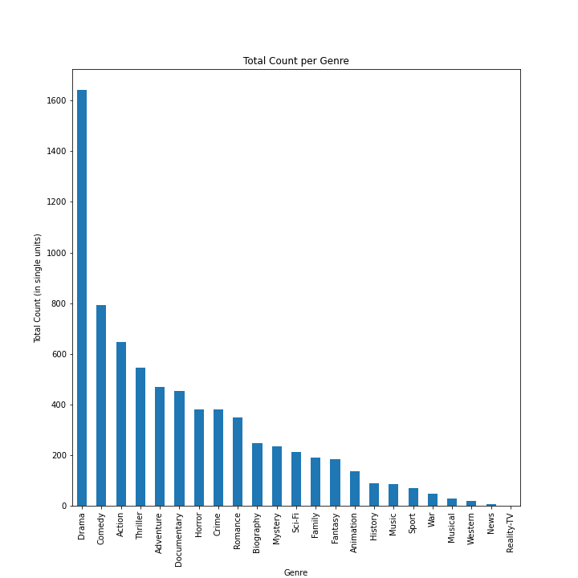

# Film Indstury Analysis to stimulate Microsoft Movie Studio's focus on profitability.
**Authors**: [Ji Hoon Chung](mailto:jhj1650@gmail.com), [Cameron Ladd](mailto:camladdsoftware@gmail.com)

## Overview
This project focuses on following sectors in terms of movie industry's profitabilty:
    * Genre
    * Movie Running Time
    * Movie Release Season
***
Our objective is to find out most lucrative solution for each of the sector above to help stimulate Micrsoft Movie Studio's focus on profitability for their next movie release.

## Business Problem
***
Microsoft sees their opportunity to jump into original video content industry along with the other Tech Giants such as Apple, Netflix and Amazon. They have decided to create a new movie studio, but they don't know anything about creating movies. We are charged with exploring all sorts of movie industry data such as budget, gross earning, types of genere, moive runtime, release date, etc. We must effectively translate these raw data into actionable insights that the head of Microsoft's new movie stduio can use to help decide what type of films to create.

## Data Understanding
We've used two main dataframes to analyze our findings:
1. imdb.title.basics
    * Runtime_minutes
    * Genres
2. tn.movie.budgts.csv
    * release_date
    * production_budget
    * domestic_gross
    * worldwide_gross

Using the above two dataframes, we need to merge and clean up to prepare a final dataframe including following Target Variables.

FINAL_DF:

    * Genre (After cleaning with only 1 Genere per row)
    
    * Runtime_minutes
    
    * Profit
    
    * % Profit
    
    * Release_Season
    
    * Domestic_gross
    
    * Worldwide_gross
    
    * Total_gross

## Analysis Focus

By relating above variables, our aim is to find out solutions to 3 critical questions below:
1. What is the most profitable genre?
2. What is the most profitable running time for each genre?
3. What is the most profitalbe season to release for the most profitable genre?

## Methods & Results
***
We used series of data and visualizations to obtain the following results. We decided to narrow our genre analysis to only the top 8 genres based on occurence, due to the larger amount of data points to deal and also the higher popularity that is implied by the higher occurence rates.

***
### Analysis #1 - What is the most profitable Genre?

We found that the correlation between profit and gross is identical, leading to the same conclusion that Adventure is in fact the most profitable genre amongst the top 8 genres. 

The visualization depicting the average gross has bars that are conveniently stacked into two seperate categories: "Domestic Profit", and "Worldwide Profit". When analyzing 'Adventure', we see that it performs markedly better overseas than it does in the domestic setting. This analysis leads to the following conclusion for a proper course of action for the Microsoft Company: 
Prior to the release of any movie of the genre 'Adventure', Microsoft should consider investing in preliminary and aggressive action to secure movie distribution rights and begin advertisement in international countries of interest.

### Analysis #2 - What is the most profitable running time for the top 8 Genres being made?

We analyzed on the most abundancy of runtime to see have an idea of binning our runtime results.
We can visulize three important aspects:
   1. Movie runtime is most abundant in the runtime range between 80 minutes to 120 minutes.
   2. Count of movies drastically fades movies with runtime less than 50 minutes.
   3. Count of movies drastically fades movies with runtime more than 150 minutes.
   
10 types of bins were made to categorize run_time based on this visualiation.

First graph shows Runtime vs. Mean % Profit & Second graph shows Runtime vs. Median % Profit.
Both graphs look completely different which tells us there are many outliers that are deprecating mean % profit.
So we figured % Profit by Median graph would be more trustworthy of analyzing these dataframes.

Final Result shows:
1. TOP 5 Most Profitable running time and its genre:
     1. Comedy with running time between 120 to 129 minutes. (Median %Profit = 506%)
     2. Adventure with running time greater than 150 minutes. (Median %Profit = 387%)
     3. Thriller with running time between 130 to 150 minutes. (Median %Profit = 356%)
     4. Action with running time between 130 to 150 minutes. (Median %Profit = 355%)
     5. Adventure with running time between 130 to 150 minutes. (Median %Profit = 326%)
     
2. Top % Profit mostly come from genres with more than 120 minutes of running time.

### Analysis #3 - What is the most profitable season to release for the most profitable genre found on Analysis 1?

1. Adventure Genre proved to be the most profitalbe Genre according to Analysis #1.
2. Adventure Genre at run_time more than 150 minutes proved to be the second most 
   profitable runtime & genre combination.
3. We've binned our seasons into following for the Release Season:
    * Fall = September, October, November
    * Spring = March, April, May
    * Summer = June, July, August
    * Winter = December, January, February
4. Both % Profit Mean & % Profit Median show uniform result. 
   Spring proved to be the best season to release Adventure movies!
   
## Recommendation

We recommend Microsoft Movie Studio to focus on developing their initial movie within the following criteria:
    * Genre = Adventure
    * Run_time = More than 150 Minutes
    * Release Season = Spring (March, April, May)

Following Movie Run Time & Genre Combinations are MUST to be avoided:
    * Thriller @ 50 to 69 mins of running time.
    * Comedy @ More than 150 mins of running time.
    * Crime @ 90 to 99 mins of running time.

## Further Questions

Movie Budget would also play significant role in reversing % profit for each genre and movie running time.
It would be nice to visualize the mean/median movie budget for each of the result we provided above.

#### Navigation
- 'Data Cleaning Process': Folder containing a notebook that has the data cleaning and organization and modeling process for all analysis questions concisely laid out
- 'Images': Fodler containing the downloaded visualizations from our analysis
- `ZippedData`: Folder containing all relevant data for the analysis 
- 'Final_Presentation_Notebook.ipynb': The final notebook containing our discussion and visualizations
- `README.md`: Display document containing our key findings and visualizations. For more in depth discussion, see the 'Final_Presentation_Notebook.ipynb' file
